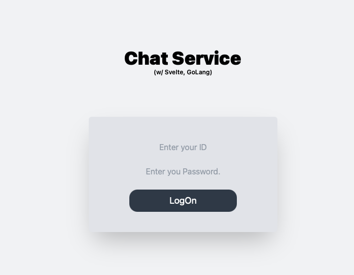

# Messenger

## TODO
-[x] Install Tailwind  
-[x] Create Messenger Component  
-[x] Create MessengerInput Component  
-[x] Create Message Component  
-[x] Implement Message Variable Connection  
-[x] Refactor DateTime  
-[x] Enter Action  
-[x] Connect Websocket  
-[ ] Fix Message Enter Shape  
-[ ] Login  
-[ ] Room Lists  
-[ ] Room